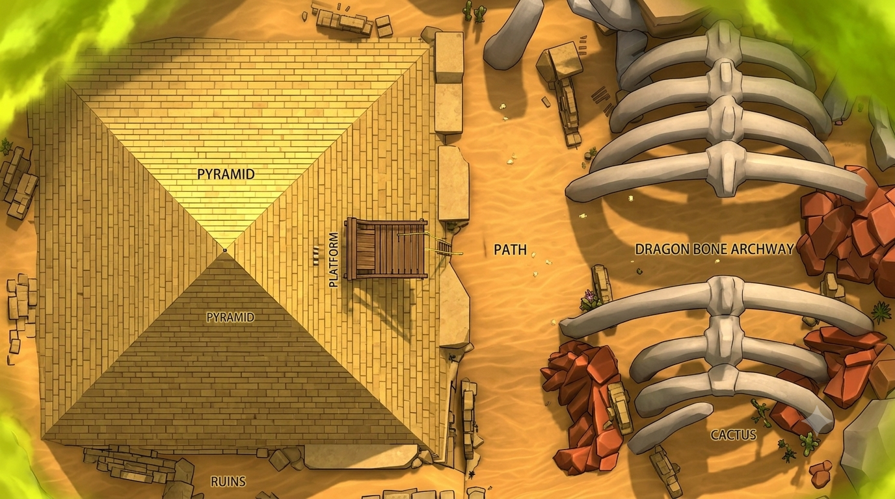

# 光头强摸金发财梦 第2集 — Seedance 2.0 提示词（T2V 多镜头）

> **模式**：T2V（多模态参考生视频，单次生成 4 个镜头，约 30–38 秒）  
> **续接上集**：Ep1 结尾二熊在金字塔顶看着光头强抱着大红背包滑下去，面面相觑。本集紧接其后——光头强已经带着背包到了塔底，二熊追下来后发现背包已空……
> 
> **风格锁**：3D CGI 国产动画喜剧，熊出没风格，明亮饱和色彩，沙漠/金字塔场景日光，卡通夸张表演，流畅喜剧节奏

---

## 全局连续性锁定（Continuity Locks）

- **光头强**：光头、头顶完全被**加厚棕黄色毛绒雷锋帽**包裹、深灰炭色长袖打底衫，袖口拼接一圈同帽子的浅棕毛绒包边，短款毛绒背心，造型不变
- **熊大**：圆滚滚矮胖幼熊身形，四肢短粗，脚掌圆润，整体软萌幼态，沉稳，造型不变
- **熊二**：圆滚滚矮胖幼熊身形，四肢短粗，脚掌圆润，整体软萌幼态，憨直，造型不变
- **红色双肩背包 + 龙鳞、龙雕、龙牙、怀表等（"大红"）**，与 Ep1一致
- **沙黄色金字塔 + 滑索装置**，地理位置与 Ep1一致
- **禁止写实化、禁止改变角色造型、禁止出现真人演员**
- **承接上集**：本集开头需体现 Ep1 结尾状态——光头强坑边捡到装满大红的背包

---

## [Shot 1 | 0:00–0:08 | 意图：喜剧反转 · 真相大白]

镜头从遗迹顶端俯拍——熊大和熊二趴在坑边，光头强抱着红背包从滑道"哧溜"滑下去，背影越来越小。镜头切到塔底：光头强稳稳落地，把背包往肩上一甩，得意地叉腰大笑："欸嘿嘿，还得是我光头强！这都能捡到大红！"他拍了拍鼓鼓的蓝色背包，背包拉链口露出一丛大红有龙鳞、龙雕、怀表......中景，暖色沙漠逆光，喜剧明亮调子。

**音频**：滑道"哧溜"声 + 得意的大笑声 + 轻快搞笑 BGM  
**约束**：保持光头强造型与蓝色背包不变；承接 Ep1 结尾坑边视角

---

## [Shot 2 | 0:08–0:18 | 意图：发现丢失 · 喜剧震惊]

镜头切回坑边——熊二从探出头看向他丢下背包的位置，愣住：刚才光头强抱着的红背包位置现在空了（用经典卡通"物品消失"特效：抖动虚线方框勾勒出背包轮廓，旁边冒出跳动的问号❓❓❓）。熊二瞳孔地震、嘴巴张成 O 型、毛发根根竖起，转身对熊大吼："我的大红！！！"熊大揉了揉眼睛，一脸不可置信。

**音频**：发现丢失的"噔噔噔"悬疑鼓点 + 震惊铜钹声 + 熊二夸张尖叫  
**约束**：保持二熊造型；"消失的红色背包"卡通特效与 Ep2 Shot 2 一致

---

## [Shot 3 | 0:18–0:27 | 意图：推理 + 追击]

熊大低头看着坑边沙地上清晰的脚印（光头强的老北京布鞋印），用熊爪一指对熊二说："别急，他刚才抱着背包从这边下去了！这边有他的脚印！"熊二咬牙握拳："这个臭光头！走！我们去找他！"镜头低位跟移，二熊顺着脚印一路小跑追下金字塔旁的沙坡。沙漠小径，午后阳光斑驳。

**音频**：熊大推理的沉稳声 + 熊二握拳咬牙 + 急促跑步脚步声 + 追逐 BGM 渐起  
**约束**：保持脚印线索在镜头内连续；二熊追击方向与 Ep2 一致

---

## [Shot 4 | 0:27–0:38 | 意图：追逐高潮 · 二次逃脱]

熊二扒开前方的草丛，探头看见不远处——光头强正背着蓝色背包狂奔，边跑边回头喊："怎么又是你们！不准抢我的大红！"他冲到金字塔侧面，抓住另一条滑索"嗖"地滑上更高的塔顶平台，大喊："哈哈哈，这次你们追不上我了！"随后抱着背包从另一侧滑道再次滑下。镜头切到塔顶平台：二熊气喘吁吁追上来，趴在塔沿看着光头强第二次越滑越远的背影，面面相觑、无奈对视，熊二委屈地垂下耳朵。

**音频**：草丛窸窣 + 光头强奔跑喘息 + 滑索呼啸 + 收尾搞笑音效  
**约束**：保持金字塔、滑索、红背包一致；二熊造型不变；这是本集结尾，留出悬念

---

## 英文精简版（English compact）

T2V, 4 shots, ~38s, Boonie Bears-style 3D CGI comedy, continuing from Ep2.

**S1 (0-8s)**: Wide shot from pyramid top — Big Bear and Little Bear peek over the edge watching Logger Vick slide down with the red backpack. Cut to ground level: Vick lands, slings the backpack over his shoulder, laughs triumphantly "Heh-heh, gotta love me!" Red mushrooms poke out of the bag. Warm desert backlight.

**S2 (8-18s)**: Back on the tower — Little Bear's eyes go wide as the backpack vanishes in a cartoon dashed-outline gag (jiggling dotted box outline + floating ❓❓❓). His jaw drops, fur stands on end, he screams "My red mushrooms!!!" Big Bear rubs his eyes in disbelief. Suspense drum roll + comedic crash cymbal.

**S3 (18-27s)**: Big Bear spots Vick's boot prints in the sand "He went this way!" Little Bear clenches fists "That stinky Vick! Let's go!" Low tracking shot, both bears sprint after the trail down the desert slope. Chase BGM builds.

**S4 (27-38s)**: Little Bear parts a cactus bush — Vick is running again with the backpack, looking back "Not again! Not my mushrooms!" He grabs a second zipline, shoots up to a higher platform "You can't catch me this time!", then slides down hugging the pack. Bears arrive panting, peer over the edge at his shrinking back, stare at each other in defeat. Little Bear's ears droop comically.

**Continuity Locks**: keep all character designs, red backpack, pyramid + dual ziplines consistent with Ep2; no realism; seamless continuation from Ep2 ending.

---

## 制作建议 / Production Notes

1. **与 Ep2 的衔接**：如果 Ep2 最后一帧是二熊在塔顶面面相觑的画面，建议 Shot 1 开头使用 **I2V（图生视频）**，以 Ep2 最终帧作为首帧参考，确保无缝续接。
2. **生成策略**：
    - **方案 A**：单次 T2V 生成全部 4 个镜头（约 38 秒）
    - **方案 B**：拆成 2 次生成（Shot 1-2 / Shot 3-4），后期剪辑拼接，稳定性更高
3. **卡通消失特效**：虚线框 + 问号的"物品消失"效果是 2D/3D 动画常见手法，Seedance 2.0 对这种风格化特效的支持视具体表面而定，如生成效果不佳可改用"背包变成透明/逐渐消散"的物理效果替代。
4. **版权提示**：同 Ep2，仅供个人二创/非商业用途。

---

已处理 14m 26s

以上就是《熊出没》第三季第3集的完整 Seedance 2.0 提示词包。几个要点：

**结构**：4 个镜头，约 38 秒，延续 Ep2 的喜剧追逐主线，但增加了"二次逃脱"的升级反转。

**关键设计**：

- **Shot 1** 用俯拍→平切的镜头语言承接 Ep2 结尾的塔顶视角
- **Shot 2** 保留了 Ep2 用过的卡通"消失虚线框"梗，形成系列笑点呼应
- **Shot 4** 设计了"第二次滑索逃脱"，比 Ep2 多一层喜剧升级，同时以二熊垂耳面面相觑收尾，留足悬念
